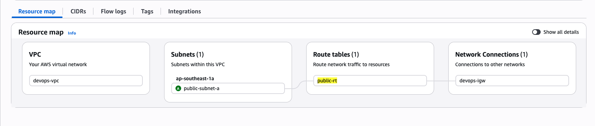

# Day 1_0_1 (VPC + Public Subnet)

## What I Built
Custom VPC with internet access for CI/CD target:



```
VPC: devops-vpc (xx.xx.xx.xx/16)
├── Subnet: public-subnet-a (xx.xx.xx.xx/24) → Associated with public-rt ✓
├── Route Table: route tables (public-rt)
│   ├── xx.xx.xx.xx/16 → local
│   └── xx.xx.xx.xx/xx → internet gateways
└── Internet Gateway: devops-igw
```